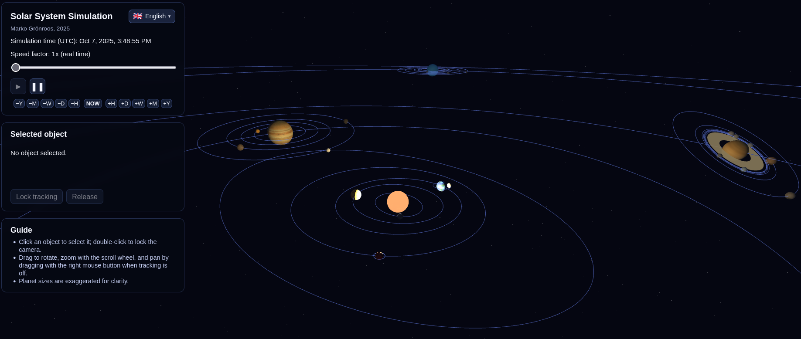

# Solar System Simulation

This project renders a real-time, browser-based model of the Solar System with accurate orbital mechanics seeded from JPL Horizons ephemerides. Bodies are textured and lit with Three.js, and the camera can focus on any star, planet, or major moon for an immersive, skybox-backed view. A live demo is available at [turunursa.fi/magi/solarsystem](http://turunursa.fi/magi/solarsystem/).



## Highlights
- Physically grounded: Orbits, axial tilts, and rotation rates start from current UTC time and evolve using Keplerian propagation. Outer-planet moon distances are scaled for readability while preserving ordering.
- Rich visuals: Locally cached textures (`data/textures/`) provide planetary detail, enhanced selection halos, and configurable Saturn rings tuned to match the ring plane.
- Hands-on controls: Drag with the left mouse button to orbit, right-drag to pan, and use the scroll wheel to zoom. Double-clicking locks the camera to the chosen body.
- Timeline tooling: Step simulation time via quick-adjust buttons (+/-H, +/-D, +/-W, +/-M, +/-Y), jump back to "NOW", and modulate speed exponentially from real time up to 10^11x.
- Localization: The HUD, hints, and instructions are available in Finnish (default), English, Swedish, German, and Greek, with a language picker displaying native names and flags.

## Running the App
No build step is required—open `index.html` in any modern browser with WebGL and `Intl` support. For a lightweight static host:

```bash
python3 -m http.server 8080
# then browse to http://localhost:8080/
```

Textures load from `data/textures`, so keep that directory relative to the HTML file when deploying.

## Development Notes
- Source entry point: `main.js` (Three.js scene setup, simulation loop, localization state).
- Styling: `styles.css` defines the compact HUD layout tuned for multiple languages.
- Planetary and satellite metadata (radii, orbital elements, descriptive copy) lives in `main.js`; adjust there when adding bodies.
- The `docs/` folder stores project assets such as screenshots for documentation.

## Credits
- Authoring & design: Marko Grönroos (2025)
- Orbital references: NASA/JPL Horizons API state vectors (retrieved October 2025)
- Libraries: [Three.js](https://threejs.org/) with `OrbitControls`
